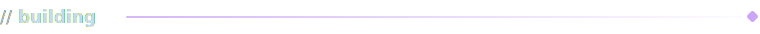
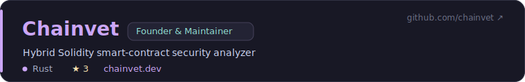
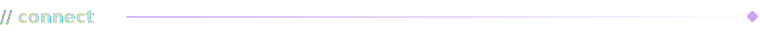
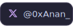
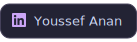
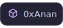
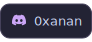
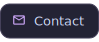

<!-- ┌────────────────────────────────────────────────────────────┐ -->
<!-- │  0xAnan/0xAnan  ·  profile README  ·  攻                    │ -->
<!-- │  palette: catppuccin mocha (matches anan.rocks)            │ -->
<!-- └────────────────────────────────────────────────────────────┘ -->

<!-- ░░░ ANIMATED WAVE BANNER ░░░ -->

<!-- ░░░ TYPING ANIMATION ░░░ -->

<!-- ░░░ STATUS BADGES ░░░ -->

<!-- ░░░ IDENTITY ░░░ -->

<!-- ░░░ FOCUS ░░░ -->
 

<!-- ░░░ BUILDING ░░░ -->
 

<!-- ░░░ CONNECT ░░░ -->
 

 

&nbsp;
&nbsp;
&nbsp;
&nbsp;

 

<code>0xANAN / 攻</code> · Breaking, learning, documenting

<!-- ░░░ ANIMATED FOOTER WAVE ░░░ -->

